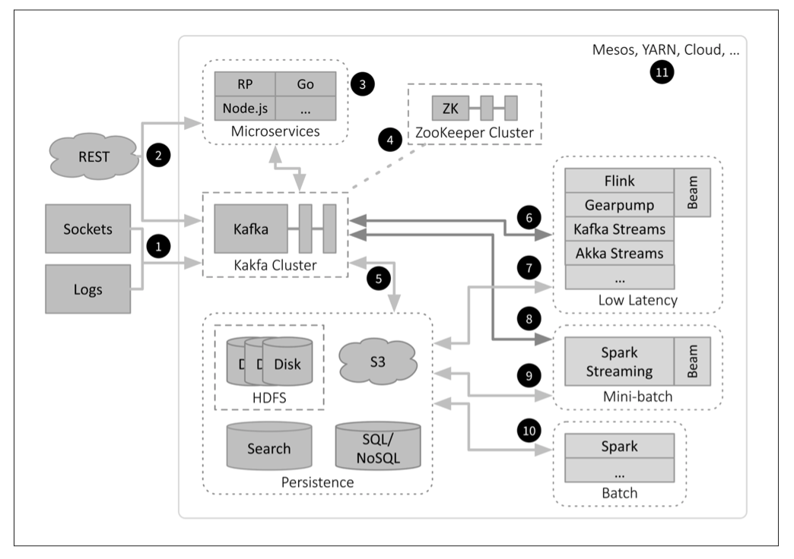
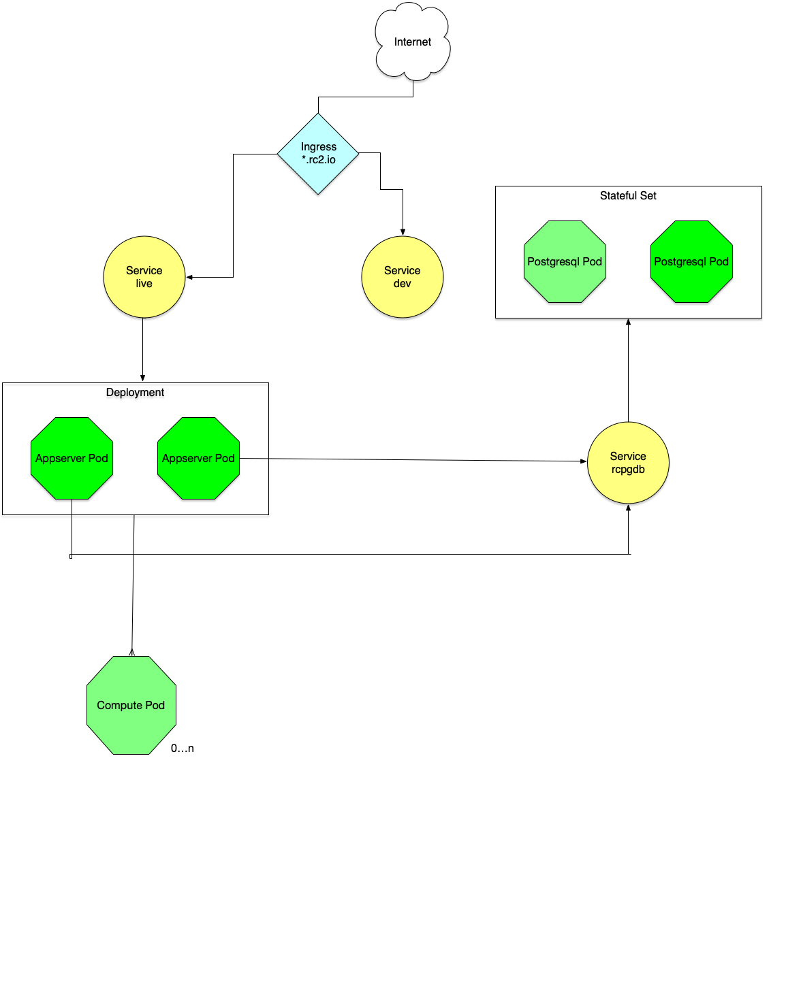

```{r setup, include=FALSE}
knitr::opts_chunk$set(echo = FALSE)
```

## DevOps for Data Science

Data Science Platforms are complex! How do we solve the data analysis issues of:  

* collaboration,  
* sharing, 
* reliability  
* scalability, and  
* reproducibility?  

DevOps (development + operations) has been revolutionized by containers and methods of orchestrating containers. Specifically, we will examine two technologies which are changing how complex software systems are built, deployed, and maintained. These are:  

* [Docker](https://www.docker.com): a technology for building, deploying, and running container images;  
* [Kubernetes](https://kubernetes.io): a technology for deploying, scaling, and managing containerized applications. 

Docker Swarm is not as scalable or feature complete as Kubernetes.

## Docker

Docker containers are becoming essential for software development and for the deployment of complex computing environments. This talk presents Docker solutions to address these and other use cases relevant to statisticians and data scientists.

- [Rocker](https://www.rocker-project.org): R-based images built by and hosted on Docker Hub

- [RSpark](https://github.com/jharner/rspark): R and Spark-based images hosted on Docker Hub

- [Rc$^2$](https://github.com/rc2server): R-based image hosted on GitHub.

Perhaps the most important reason for using Docker by statisticians and data scientists is the complexity of their computing environments, e.g., aligning version numbers for R and its packages, drivers, SQL and NoSQL databases, Hadoop, Spark and its packages, TensorFlow and GPUs, etc.

## What is Docker?

Docker allows developers, devops, and sysadmins to develop, deploy, and run applications using containers. We call this containerization.

Containers are:

* Flexible  
* Lightweight  
* Portable  
* Scalable

A container runs natively on Linux and shares the kernel of the host machine with other containers. A container runs as a discrete process and thus its memory requirements are nearly equivalent to other executables, i.e., it is lightweight. On the other hand, a virtual machine runs a guest OS which is built on a hypervisor, through which host resources are accessed. Running multiple VMs is very heavy. 

## Why Use Docker?

A [Container Platform](https://www.docker.com/what-docker#/container-platform) provides a complete solution, e.g., the components needed for teaching a data science program. Increasingly these platforms are being built on Kubernetes.

## Images and Containers

The two principal Docker entities are:

* Image: an executable package that includes everything needed to run an application  
* Container: a runtime instance of an image

The image contains the code, configuration files, environmental variables, libraries, and the runtime. You can see the images by running the following command in a terminal:
```
docker images
```
A container is an image with state, i.e., a user process. You can view the running containers by executing:
```
docker ps
```
or you can see all containers by exectuing:
```
docker ps -a
```

## Running an Image

You can run an image by:
```
docker run hello-world
```
If the `hello-world` image is not found locally, it is automatically downloaded and launched from [Docker Hub](https://hub.docker.com), the default image registry.

## Rocker Project

Rocker project: a widely-used suite of Docker images with customized R environments for particular tasks.

Currently, there are 17 repos in [rocker-org](https://github.com/rocker-org).

The most important to us are:  

* [rocker-versioned](https://github.com/rocker-org)
    + r-ver: versioned base R  
    + rstudio: adds rstudio  
    + tidyverse: adds tidyverse and devtools   
    + verse: adds tex and publishing packages    
* shiny  
* ml  

These and other available images provide a large number of use cases.

## Running R/Rstudio in Containers

A terminal version of R can be run in `r-base` or `r-ver`.
```
docker run --rm -ti rocker/r-base bash
```
The `rocker/r-base` image is downloaded from Docker Hub (if not already in the local filesystem) and run. The `-it` flags cause a `bash` session to start. Typing R into the terminal starts R (currently version 3.5). The `-rm` flag causes the container to be removed when the session is exited.

Or just:
```
docker run --rm -ti rocker/r-base
```

RStudio can be run by:
```
docker run --rm -p 8787:8787 rocker/rstudio
```
Open a browser with the URL `localhost:8787` and signin with user/password: `rstudio/rstudio`.


## Extending Images

A developer or user may find that an image needs to be extended, e.g., a critical R package is missing or needs to be updated. This can be done in one of two ways:  

* install the R package inside the container using `install.packages`, or 
* rebuild the image by modifying the `Dockerfile`.

The first method results in mutable infrastructure, i.e., changes are made incrementally. The state of the infrastructure is thus dependent on incremental updates. This method should only be used in critical situations and should be viewed as a temporary fix.

The second method results on an immutable infrastructure, i.e., the state does not change based on actions by the user. Rather, the image is completely rebuilt by the developer.

## Rocker Deployment

Any of the Rocker images can be deployed in a single container. This container can be run on your laptop, on your departmental server, or on a cloud platform such as AWS. Although the Rocker images can be built from their GitHub sources, typically the pre-built images on Docker Hub are simply downloaded and run.

Why go to this trouble? Why not just run RStudio locally or on a server?  

Suppose you are writing a paper and you want it to be truly reproducible. At this point you want to capture and maintain not only the Rmd or Rnw files, but also the synchronized R and required package versions. Further, the R environment can be synchronized with Linux distro and version along with required storage platform for your data. 

But the reasons go well beyond reproducibility.

## Using Docker for Continuous Integration Deployment [DevOps]

Docker is a platform for containerized networking, compute, and storage for distributed applications. Docker improves: 

* Velocity: increase flow by continuous integration (CI) and continuous delivery (CD);    
* Variation: converge artifacts with immutable binaries;  
* Visualization: visualize (elevate) services in the pipeline by bounding context and using containers for isolation.   

[Reference paper on CI/CD](https://www.docker.com/sites/default/files/WP_Docker%20and%20the%203%20ways%20devops.pdf)

## A Modern Data Science Platform

\vspace{0.5cm}




[Container Platform](https://www.docker.com/what-docker#/container-platform)

## Rspark Project

RSpark extends Rocker to embrace big-data platforms. In particular, RSpark's main image, `rstudio` is built on Rocker's `verse` image, which contains RStudio, the Tidyverse, LaTeX, etc. Various data science R packages are added to this image, e.g., `sparklyr`, `SparkR`, `tensorflow`, `rhipe`, etc.

RSpark has other images commonly used in data science:  

* PostgreSQL: a powerful relational database;  
* Hadoop: a distributed storage (HDFS) and computing (MapReduce) environment;  
* Hive: a distributed data warehouse built on HDFS;  
* Spark: a cluster version for distributed computing.

Note: RSpark could be built using RCloud rather than RStudio as an interface to R. RCloud is built on a lower-level image, i.e., `rocker/drd` than the `rocker/verse` image used in RSpark.

We can scale the Spark deployment to multiple workers in RSpark. But how do we scale RSpark to a large number of workers for Spark and possibly HDFS/Hive?

### Use Kubernetes for container orchestation!

## Kubernetes

[Kubernetes](https://www.digitalocean.com/community/tutorials/an-introduction-to-kubernetes) is a platform for running and coordinating related, containerized applications across a cluster of (typically virtual) machines. It manages the complete lifecycles of containerized applications and services to provide:  

* predictability  
* reliability
* scalability  
* availabilty  

Container and Kubernetes developers should adhere to certain principles:  

* immutable infrastructure: update an image with a newer image in a single operation, i.e., no incremental updates (except in emergencies);  
* declarative configuration: describe the desired state of your application.

In mutable infrastructures changes are applied incrementally, e.g., `apt-get` in Linux or `install.packages` in R. This should only be done as a temporary fix. An imperative declaration defines the state as a series of actions rather than a declaration of the desired state as is done with Kubernetes.

Kubernetes makes sure the actual state of your environment is aligned with the desired state. Not only that, Kubernetes is an online, self-healing system, i.e., it continuously takes action to ensure the current state matches the desired state.

## Kubernetes Architecture

The machines in a Kubernetes cluster are classified as:

* a master server: the primary point of contact with the cluster. It exposes the Kubernetes API, aligns the actual state to the desired state, schedules work, orchestrates communication, etc.  
* nodes: servers responsible for running workloads using local and external resources.

The API server is the management point of the cluster, e.g., for configuring Kubernetes workloads and organizational units. The API interface is RESTful. A CLI client called `kubectl` is the default method of interacting with the Kubernetes cluster from a local computer.

The basic Kubernetes unit is the pod. Containers are assigned to pods---not hosts. Pods should contain a single application or related applications, e.g., ones that need to share the same filesystem.

## RSpark on Kubernetes

RSpark consists of an ensemble of containers, but the \texttt{rstudio} container is central and provides RStudio Server and various drivers allowing connectivity to other services, e.g., Spark and HDFS. Unfortunately, RStudio Server Pro is requited to run Kubernetes. See: [Using Docker images with RStudio Server Pro, Launcher, and Kubernetes](https://support.rstudio.com/hc/en-us/articles/360019253393-Using-Docker-images-with-RStudio-Server-Pro-Launcher-and-Kubernetes).

The intent of RSparkHub is to launch RSpark for each user. However, there appears to be no way to shutdown RStudio processes on demand so a 0 exit code is returned to Kubernetes. Instead, we have automated to the process using Ansible scripts on AWS.

## Rc$^2$ on Kubernetes

Rc$^2$ has two components:

- Rc$^2$ Server: a modern architecture for running R projects designed to interface with other environments at scale, e.g., Spark and Tensorfow

- Rc$^2$ Client: written in Swift currently running on macOS and iOS.

Rc$^2$ is being deployed to [Digital Ocean Kubernetes](https://www.digitalocean.com/products/kubernetes/).

## Rc$^2$ Architecture




## Rc$^2$ Deployment

Kubernetes is available on AWS, Azure, and of course Google Cloud as a service. However, these cloud providers do not have predictable price models and users/developers can incur large unexpected costs. [Digital Ocean Kubernetes](https://www.digitalocean.com/products/kubernetes/) gives the user far more control over these costs, i.e., limits can be set and the user is only charged for what is actually used.


